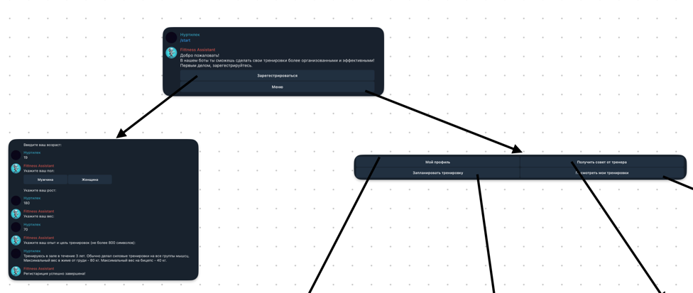
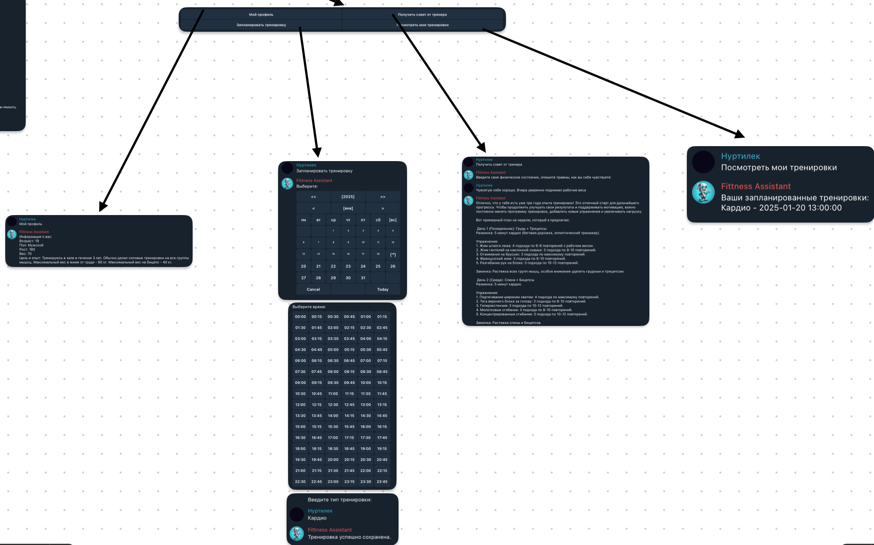

# Документация для проекта: Telegram-бот для планирования тренировок

## **Описание проекта**

Telegram-бот, разработанный на основе библиотеки `aiogram`, помогает пользователям составлять персонализированный план
тренировок на неделю, сохранять выполненные тренировки и получать уведомления о предстоящих занятиях..
Разработал `Мамашакиров Нуртилек Жанабидинович` БИВ237
---

## **Основные функции**

1. **Составление плана тренировок**:
    - Пользователь вводит цели (например, похудение, набор массы, поддержание формы).
    - Учитывается текущее состояние пользователя (например, уровень подготовки, наличие травм).
    - Бот предлагает план тренировок на неделю, включая типы тренировок и их продолжительность.

2. **Сохранение данных о тренировках**:
    - Хранится история всех тренировок пользователя.

3. **Уведомления**:
    - Напоминания о запланированных тренировках.

---

## **Технические детали**

### **Технологии**

- **Язык программирования**: Python.
- **Библиотека для работы с Telegram API**: `aiogram`.
- **База данных**: `SQLite`.

### **Архитектура**

1. **Telegram-бот**:
    - Реализован с использованием `aiogram` для обработки сообщений и взаимодействия с пользователем.

2. **База данных (SQLite)**:
    - Таблицы:
        - **Users**: Хранит данные о пользователях (Telegram ID, имя, цели, уровень подготовки).
        - **Trainings**: Хранит информацию о тренировках (тип, дата, статус выполнения).
        - **Messages**: Хранит данные о сообщениях пользователя

3. **Логика обработки**:
    - Обработка пользовательского ввода для определения целей и состояния.
    - Генерация плана тренировок на основе введенных данных.
    - Сохранение расписания тренировок
    - Сохранение персональных данных

4. **Уведомления**:
    - Используется встроенный планировщик задач (`asyncio`, `APScheduler`) для отправки уведомлений в заданное время.

---

## **Работа с ботом**

### **Основные команды**

- `/start` — Регистрация пользователя и приветственное сообщение.
- `/set_plan` — Добавить тренирвоку в свое расписание
- `/view_plan` — Просмотр текущего плана тренировок.
- `/get_advice` — Попросить сгенерировать тренирвочный план исходя из своих целей, опыта, кондиций
- `/my_info`  — Личная информация
- `/menu`  — Открытие меню
- `/set_aim`  — Обновить цель
- `/set_weight`  — Обновить вес
- `/set_height`  — Обновить рост
- `/set_age`  — Редактировать возраст

### **Схема работы**

---

